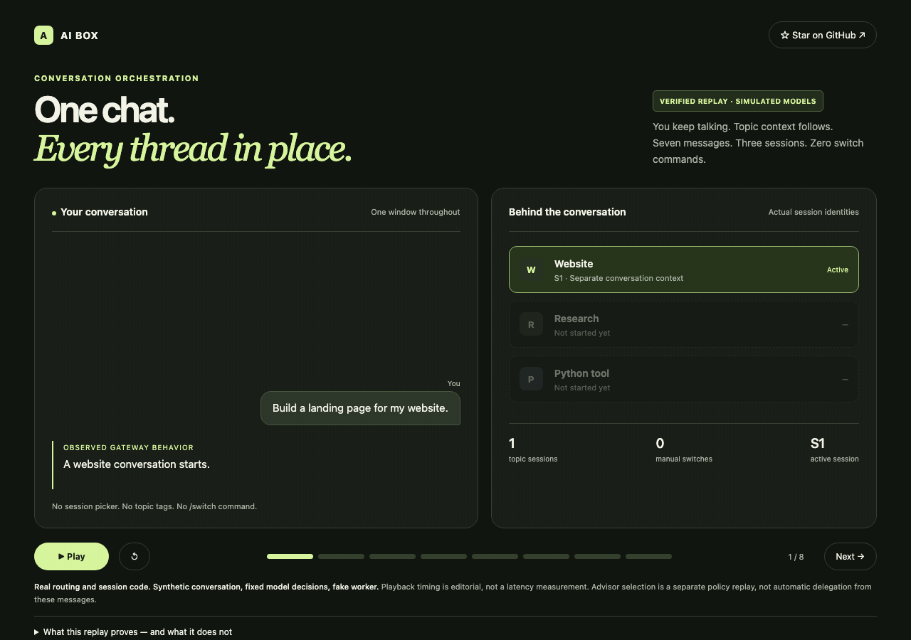

# AI Box Gateway

### One chat. The right context. A Manager that keeps track.

[](https://github.com/YunongDai2005/aibox-gateway/actions/workflows/test.yml)
[](LICENSE)
[](package.json)

**AI Box is an experimental AI conversation orchestration system built around one idea: you should be able to talk naturally in a single chat while a Manager finds the right existing session or starts a new one.**

Keep talking, return to an earlier project, add a requirement, or stop a task. The design goal is for the system to manage conversation context and execution on your behalf.

The current implementation connects WeChat, OpenClaw, and a DSH command-line worker on Linux. It includes automatic topic routing, a Manager for conversations during execution, session handoffs, and a plugin-based execution pipeline.

[Design goal](#design-goal) · [Current capabilities](#what-works-today) · [Quick start](#try-the-replay-tests) · [Roadmap](#roadmap) · [Contributing](#contributing)

## Watch the replay

[](https://YunongDai2005.github.io/aibox-gateway/demo/)

**[Open the interactive demo →](https://YunongDai2005.github.io/aibox-gateway/demo/)**

Seven messages move between a website, battery research, and a Python tool without session selectors or switch commands. The recorder verifies that returning to each topic restores its original worker session ID. A separate advisor scene shows quota filtering and a simulated Manager choice for a coding task.

**This is a reproducible replay, not a live product recording:** gateway/session code and advisor selection functions are real; messages, model decisions, quota balances, and the worker are test fixtures. It demonstrates routing mechanics, not real-model accuracy or concurrent task execution. The visual captions describe verified state rather than actual worker replies.

```bash
npm run demo:record
# Open docs/demo/index.html in your browser
```

See the [recorder and evidence](demo/README.md). The viewer is self-contained and can be opened locally.

## Design goal

> **Users should not have to manage sessions. The system should keep their tasks separate, preserve context, and follow through.**

A single conversation can contain several ongoing projects. The Manager should understand which one each message belongs to, retrieve its context, and decide what happens next.

### The experience we are building toward

*Illustrative interaction, not a recorded demo:*

```text
You:      Help me prepare the website launch.
Manager:  I'll start a session for the launch.

You:      Back to the Python tool we discussed yesterday: add CSV export.
Manager:  I'll pick up that tool's session with its existing context.

You:      Also include column headers.
Manager:  I'll attach that requirement to the CSV export task.

You:      How is the website going?
Manager:  [Reports the website task's actual state.]
```

The user stays in one chat. Behind it, the system keeps track of:

- **Conversation identity:** continue an existing topic or create a new one.
- **Message intent:** a follow-up, correction, stop request, status question, or separate task.
- **Execution state:** what is running, waiting, completed, or blocked.
- **Context continuity:** which session, handoff, and prior decisions a worker needs.

This is the direction of the project. A unified Manager for every message, durable task scheduling, and independent concurrent topic execution are still roadmap work.

## What works today

| Capability | Current implementation |
| --- | --- |
| Automatic session routing | Topic matching uses lexical/entity candidates and model judgment to stay in a session, resume another topic, or create one. |
| Conversation during execution | While the worker is busy, the Manager can answer status questions, relay notes, queue another request, or request interruption. |
| Interruptions and corrections | Stop and steering handlers coordinate interruption and follow-up execution. |
| Context handoffs | Session metadata, handoff documents, and recall hooks help carry context into another session. |
| Media handling | The WeChat adapter handles text, voice transcripts, images, and file delivery. |
| Quota-aware advisor scheduling | Helper auto-selection filters unavailable or nearly exhausted providers, then asks a Manager model to choose using task difficulty, remaining quota, reset windows, and usage preferences. A rule-based fallback handles unavailable Manager responses. |
| Optional helper workers | Scripts can invoke additional model/CLI helpers, including worktree-based code tasks. |
| Optional review and improvement | Signals, bounded parameter tuning, and proposed code changes with approval and deployment steps. |
| Replay testing | Fake messaging, worker, and model services exercise the gateway without real accounts. |

### Current boundaries

- **The Manager is not yet the universal entry point.** It primarily handles messages while the worker is busy; ordinary topic routing is a separate stage in the execution pipeline.
- **Execution is serial per chat.** Multiple topic sessions exist, but independent topics in one chat do not yet execute concurrently through the main queue.
- **The queue is in memory.** Restart-safe task recovery and delivery acknowledgments are not implemented.
- **Mailbox notes are not bound to a specific task or topic.** Stronger message-to-task association is a priority before broader concurrent or multi-user use.
- **This is a source release for integration.** Real deployment requires your own DSH configuration, OpenClaw WeChat plugin, accounts, and model access.

## Architecture

The current transport path:

```text
WeChat <--> Tencent iLink <--> AI Box Gateway <--> OpenClaw WeChat plugin
                                     |
                         Commands and ingress handlers
                                     |
                      +--------------+--------------+
                      |                             |
              Manager when busy              Per-chat queue
                      |                             |
            Reply / note / redirect           Topic routing
                      |                             |
                      +----------------------> Session context
                                                    |
                                                DSH worker
                                                    |
                                         Reply and state updates
```

The main architectural goal is to move conversation selection and scheduling behind a consistent Manager interface. WeChat provides the current entry point; the core product idea is **conversation and session orchestration**.

## Try the replay tests

Requires **Node.js 22+**. The tests use built-in Node modules: no `npm install`, WeChat account, or model credentials are required.

```bash
git clone https://github.com/YunongDai2005/aibox-gateway.git
cd aibox-gateway
npm test
```

The published v2 snapshot passed **42 test entries**, including unit-test groups and replay scenarios, locally and in Linux CI. The badge above shows the latest CI status.

Fake services bind to loopback addresses and use isolated temporary directories. Tests cover routing, sessions, media, interruptions, Manager interactions, handoffs, and review workflows. They do not establish real-provider compatibility or production routing accuracy.

```bash
# Optional comparison with the legacy v1 implementation
npm run test:both
```

The legacy comparison has known failures documented in the [validation record](docs/VALIDATION.md) (Chinese). v2 is the primary implementation.

## Deploy with your own integrations

### Prerequisites

- Linux; systemd user services for the supplied service and helper workflows.
- Node.js 22+ and a configured DSH CLI with a `headless` profile.
- OpenClaw with its WeChat plugin and your own iLink account.
- Your own model credentials and provider configuration.
- Python 3 and `zstdcat` for the optional session-history tools.

The complete supporting scripts use this example layout:

```text
/home/aibox/wx-router/      Repository checkout
/home/aibox/bin/            Scripts installed from this repository's bin/
/home/aibox/dsh-work/       Worker workspace
/home/aibox/.dsh/           Your DSH profiles and credentials
/home/aibox/.openclaw/      Your OpenClaw installation and WeChat plugin
/home/aibox/.aibox/         Generated local state
```

1. Place the repository at `/home/aibox/wx-router`. Inspect `~/bin` for name conflicts before copying the supplied `bin/` scripts there, and create `~/dsh-work`.
2. Copy `config.example.json` to `config.json`. Set `accountFile`, `pluginDir`, `dshBin`, `dshCwd`, provider/model settings, and `realBase` for your installation.
3. **Set `realBase` to the original iLink upstream.** Configure the OpenClaw WeChat channel to use the local proxy at `http://127.0.0.1:8787`. Using that proxy address as the upstream would create a loop.
4. Configure the DSH `headless` profile and its fallback patch yourself. Manager model calls read `OPENCODE_GO_API_KEY` and `DEEPSEEK_API_KEY` from `~/.dsh/.credentials.yaml`. Adjust provider endpoints and model names to your available services.
5. Run `npm start` in the foreground. Check `/healthz` and `http://127.0.0.1:8788/api/v2/status`, then verify the real messaging path. Only then install `ops/wx-router.service`, adjusting its Node executable path.

The v2 core supports `AIBOX_HOME`, `AIBOX_ROOT`, and `AIBOX_CONFIG`. Legacy v1 and some `bin/` and `ops/` scripts still assume `/home/aibox`; a different layout requires corresponding edits. The WeChat adapter imports plugin internals, so verify the module layout against your installation.

The example configuration disables helper workers, local-model routing, and automated review. Configure their dependencies before enabling them. The system dashboard, MCP control services, third-party frameworks, and model weights are not bundled.

### Privacy and access

The proxy and status API default to loopback. The status API does not provide a complete public-facing authentication layer. Keep it private, and choose worker permissions appropriate to your machine.

The published repository excludes account files, credentials, private conversations, personal knowledge, runtime state, and the original Git history. Runtime logs and handoffs can still contain private content: inspect them before sharing. See [security notes](SECURITY.md) (Chinese).

## Roadmap

The priorities follow the single-chat experience:

- [ ] **Unified Manager ingress:** route every message through a consistent decision interface, with fast paths for unambiguous requests.
- [ ] **Explicit task binding:** associate notes, corrections, questions, and results with a conversation, topic, and task ID.
- [ ] **Durable scheduling:** persist accepted tasks and delivery state; recover safely after restarts and avoid duplicate execution.
- [ ] **Ambiguity handling:** use task state and recent references to resolve follow-ups; ask a short clarification when a consequential choice remains unclear.
- [ ] **Independent topic execution:** allow bounded concurrency across unrelated sessions while serializing work that shares context or resources.
- [ ] **Routing evaluation:** add labeled replay cases for topic switches, next-day continuations, interruptions, corrections, and ambiguous references.

## Repository map

| Path | Responsibility |
| --- | --- |
| `src/manager/` | Manager decisions and worker communication |
| `src/memory/` | Topic routing, matching, and topic splitting |
| `src/agent/` | Execution pipeline, queues, sessions, and interruption |
| `src/plugins/` | Manager, topics, progress, stop, handoff, and other features |
| `src/core/` | Configuration, plugin registration, logging, and model clients |
| `src/channel/` | WeChat transport and media handling |
| `src/evolve/` | Review signals, bounded tuning, and improvement proposals |
| `bin/` and `ops/` | Optional helper tools and Linux operations examples |
| `test/` | Fake services, replay scenarios, and unit tests |

Detailed documents currently remain in Chinese: [architecture](docs/ARCHITECTURE.md), [review workflow](docs/EVOLVE.md), [project inventory](docs/PROJECT-OVERVIEW.md), and [publication scope](docs/PUBLICATION.md).

## Contributing

Contributions around **conversation routing, session memory, interruption handling, and reliable scheduling** are especially useful.

- For routing issues, provide a short **synthetic or redacted conversation**, the expected target topic, and what happened instead.
- For code changes, read the architecture document, prefer a plugin when appropriate, add a replay case for the behavior, and run `npm test`.
- English translations of the detailed docs and reproducible integration guides are welcome.

If this is a system you want to use or help build, **star the repository** and share the conversation patterns you need it to handle in [Issues](https://github.com/YunongDai2005/aibox-gateway/issues).

## License

[MIT](LICENSE). External frameworks, plugins, CLIs, and model services retain their own licenses and terms. Their code, model weights, and credentials are not redistributed here.
